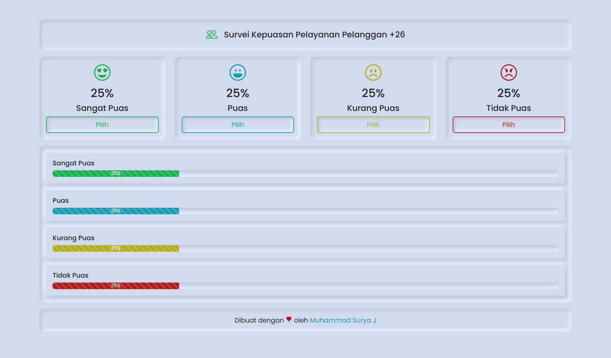

<div align="center" id="top"> 
  

  &#xa0;
</div>

<h1 align="center">Aplikasi Survei Kepuasan Pelayanan Pelanggan</h1>

<p align="center">
  

  

  

  

  

  
</p>

<hr>

<p align="center">
  <a href="#dart-about">About</a> &#xa0; | &#xa0; 
  <a href="#sparkles-features">Features</a> &#xa0; | &#xa0;
  <a href="#rocket-technologies">Technologies</a> &#xa0; | &#xa0;
  <a href="#white_check_mark-requirements">Requirements</a> &#xa0; | &#xa0;
  <a href="#checkered_flag-starting">Starting</a> &#xa0; | &#xa0;
  <a href="#memo-license">License</a> &#xa0; | &#xa0;
  <a href="https://github.com/suryamsj" target="_blank">Author</a>
</p>

<br>

## :dart: About ##

Aplikasi Survei Kepuasan Pelayanan Pelanggan dibuat dengan menggunakan ***Sveltkit*** sebagai ***Frontend***, ***PHP Native*** untuk membuat ***Rest API*** nya dan ***MYSQL*** sebagai databasenya.

## :sparkles: Features ##

:heavy_check_mark: SPA (Single Page Aplication)\
:heavy_check_mark: Realtime

## :rocket: Technologies ##

Project ini menggunakan tools dan teknologi:

- [Node.js](https://nodejs.org/en/)
- [Sveltkit](https://kit.svelte.dev/)
- [Bootstrap](https://getbootstrap.com/)
- [PHP](https://www.php.net/)
- [MYSQL](https://www.mysql.com/)

## :white_check_mark: Requirements ##

Sebelum memulai :checkered_flag:, pastikan kamu mempunyai [Git](https://git-scm.com), [Node](https://nodejs.org/en/) dan [XAMPP](https://www.apachefriends.org/)

## :checkered_flag: Starting ##

```bash
# Clone this project
$ git clone https://github.com/suryamsj/aplikasi-survei-kepuasan-pelayanan-pelanggan

# Access
$ cd aplikasi-survei-kepuasan-pelayanan-pelanggan

# Install dependencies
$ npm install

# Run the project
$ npm run dev

# The server will initialize in the <http://localhost:5173>
```

## :memo: License ##

Project ini berlisensi MIT. Untuk lebih jelasnya, silahkan lihat file [LICENSE](LICENSE).


Dibuat dengan :heart: oleh <a href="https://github.com/suryamsj" target="_blank">Muhammad Surya J</a>

&#xa0;

<a href="#top">Back to top</a>
